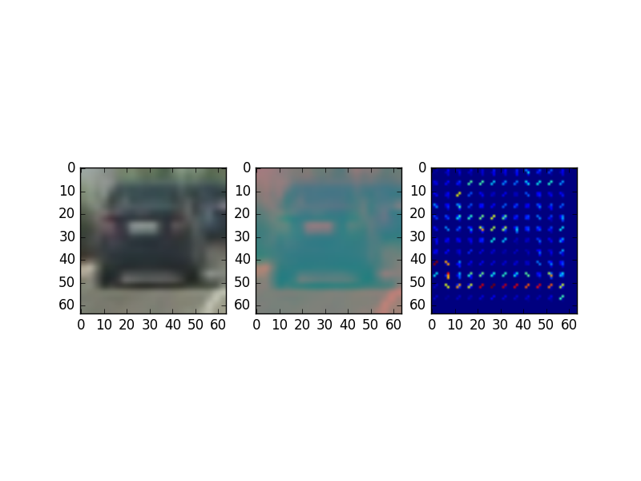
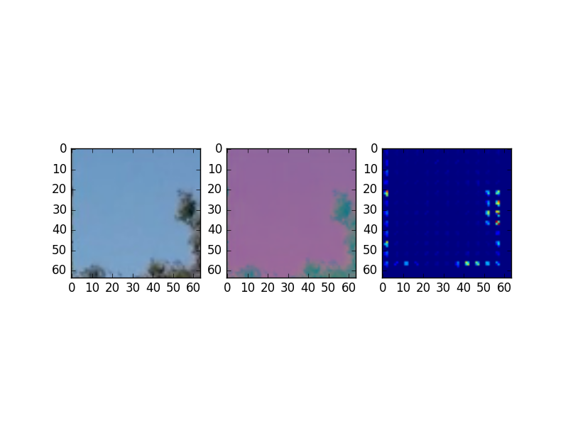
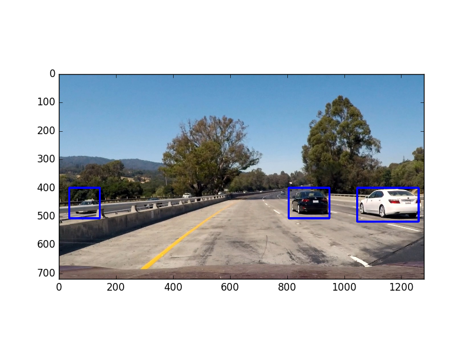
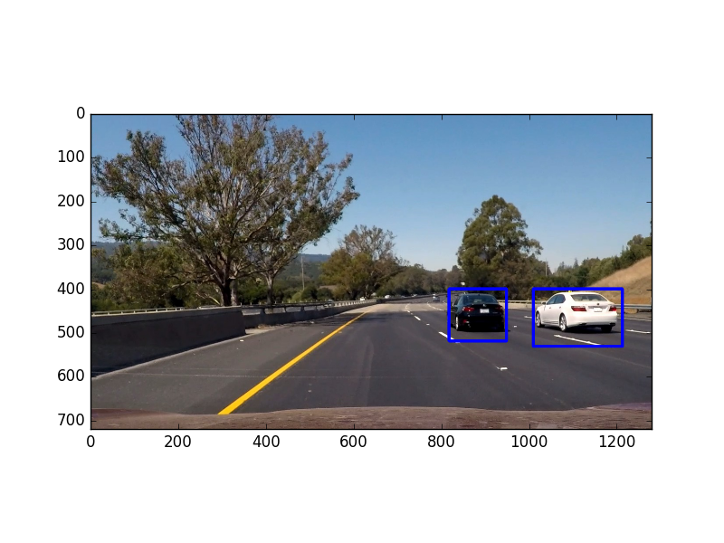
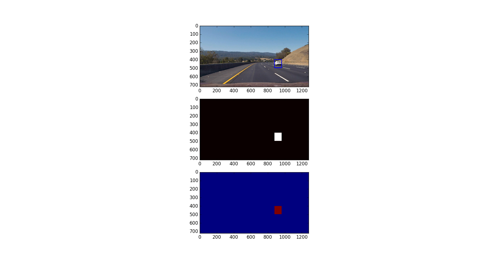
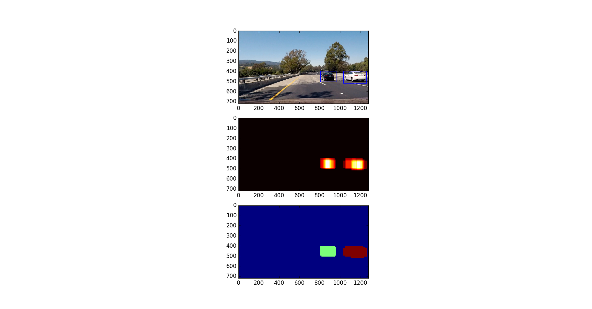

### Histogram of Oriented Gradients (HOG)

#### 1. Explain how (and identify where in your code) you extracted HOG features from the training images.

The code for this is in get_hog_features in solution/features_extract.py, which given an image and orient, pix_per_cell, cell_per_block and feature_vec extracts the HOG features in an image.

The following shows a vehicle, and the image transformed to YCrCb, and the corresponding HOG for the first channel of YCrCb

The following shows a non vehicle with the corresponding HOG for the first channel of YCrCb

These hog visualization are for images in YCrCb format for only the first channel with the following setting:

1. orient of 9
2. pixels per cell of 4
3. cells per block of 2

#### 2. Explain how you settled on your final choice of HOG parameters.

I tried various parameters for HOG. Orient of 9, pixels per cell of 4 and cells per block of 2 seems to give the best results.

I tried using a much larger orient (e.g. 20), however that seemed to create so many bins for the different orientation and be more sensntive to differences in orientation even if they are close and would not show matches when matches exist.

I tried using bigger pixels per cell (e.g. 9), however that seemed to put a large area in one cell and the larger this number became, the harder it became to have a match because it must match a bigger portion now in order to match.

When pixels per cell is too small (e.g. 2) it causes a much smaller area to be in one cell and causes too many false positives because now matches doesn't really match enough cells to indicate that it is the same shape (vehicle or not)

Cells per block had the same behaviour as pixels per cell.

#### 3. Describe how (and identify where in your code) you trained a classifier using your selected HOG features (and color features if you used them).

The code for this is in solution/features_extract.py in the following methods extract_features, bin_spatial, color_hist, get_hog_features.
The code for training the SVM is in solution/main.py.

I trained SVM using the following features:

1. Spatial binning (bin_spatial in solution/features_extract.py) with a size of (16, 16).
2. Color Histogram (color_hist in solution/features_extract.py) with 16 bins.
3. HOG (get_hog_features in solution/features_extract.py) with orient 9, pixels per cell of 4 and cells per block of 2.

These are then concatenated by extract_features.
In solution/main.py, all these are converted into a flat array, then afterwards fed into a Standard Scaler by removing the mean and scaling to unit variance.
Afterwards a support vector machine is trained using that data.
We have 8792 vehicle images and 8968 non vehicle images.
Off this data, 20% is reserved for testing and the rest 80% is used for training.

### Sliding Window Search

#### 1. Describe how (and identify where in your code) you implemented a sliding window search.  How did you decide what scales to search and how much to overlap windows?

The sliding window search is in solution/vehicle_detection.py find_cars().
The algorithm begin by:

1. Copying the image
2. Cropping the part we are not interested in searching (we only keep from 400 to 656 since the rest is the sky / trees).
3. Converting the image to YCrCb
4. Scaling the image by 1.5
5. We divide the image into 64 windows, each window has 15 blocks (blocks = (windows / pixels per cells) - 1 = (64 / 4) - 1 = 15)
6. Each time we move the window 2 cells, and we capture the entire window (15 blocks * 4 = 60 cells). This is an overlap of 96.6% (100 percent - ((cell movement / total number of cells) * 100) = 100 - ((2/60) * 100))
7. We extract HOG for all the channels for the entire image in a temporary variable (A)
8. We iterate over the image in the X direction and Y direction each time moving 2 cells
9. For each iteration we extract the current window, and get the HOG corresponding to that window from the temporary variable A. We concatenate that to bin spatial of the window resized to (16, 16). We concatenate that to the color histogram of the window for 16 bins.
10. We take this result and perform standard scaling on it (mean and scaling to unit variance) like we did with the training data.
11. We then feed this into our SVM model to predict if it is a car or not.
12. If this is a car, we capture the rectangle coordinates and add it to the list of bounding boxes.
13. We return the list of bounding boxes after we do all the iterations.

#### 2. Show some examples of test images to demonstrate how your pipeline is working.  What did you do to optimize the performance of your classifier?

I had to tweak the parameters for HOG (orient, pixels per cell and cells per block) along with spatial bin resize size and color histogram bins.
The HOG orient and pixels per cell particularly seemed to make the classifier more sensitive (as orient decreases and pixels decreases) or less sensitive (as orient increases and pixels increases).
Eventually orient of 9, pixels per cell of 4 and cells per block of 2 seemed to give the best results. Along with (16, 16) spatial binning and 16 color histogram containers.

The following are examples of vehicles detected in test images:

---

### Video Implementation

#### 1. Provide a link to your final video output.  Your pipeline should perform reasonably well on the entire project video (somewhat wobbly or unstable bounding boxes are ok as long as you are identifying the vehicles most of the time with minimal false positives.)
Here's a [link to my video result](https://youtu.be/hS5kO_Yvutc)

#### 2. Describe how (and identify where in your code) you implemented some kind of filter for false positives and some method for combining overlapping bounding boxes.

The code for this can be found in image_utils.py in apply_boxes_with_heat_and_threshold and is called from main.py in detect.

We combine overlapping windows and filter false positives by two means:

1. Overlaps from the same image
2. Overlaps of recent images (The 15 previous images).

This is done using the following process:

1. Initialize a heatmap of all zeros with the same image size
2. For each bounding box, we add 1 to all the pixels inside of it
3. Up to the previous 15 images if they exist, we also add 1 to all the pixels of all the bounding boxes that was detected in each one of them.
4. We apply a threshold of 13 to remove all false positives and only leave cars that was detected in this image and confirmed by multiple bounding boxes in this image and in previous images.
5. We then extract only the boxes that have met this threshold.
6. We then draw the boxes on the image.

### Here are six frames and their corresponding heatmaps:

 The first sub-image is the image with the bounding boxes, the second one is the heatmap and the third one is the one with the labels.

As we can see the heatmap is very bright in areas where the car exist, and then the result of this heatmap is then fed into labels which is used to draw the bounding boxes.

---

### Discussion

#### 1. Briefly discuss any problems / issues you faced in your implementation of this project.  Where will your pipeline likely fail?  What could you do to make it more robust?

The main problems I faced was the following:

1. Using only one image sometimes would yield false positives if the extraction parameters are too sensitive (i.e. low HOG orient and low pixels per cell).

  Along with fine tuning these parameters, I also used the previous 13 images and increased the threshold which removed a lot of these false positives.
  However this came with a price, which is, the bounding box appear a bit lagged (since it used a lot of signal from previous images).
  Moreover if in multiple subsequent images no cars were detected even if it did exist (which happened very rarely), this approach would not catch it.

2. If two cars are very close to each other, the algorithm cannot distinguish between them and think it is one big car.

  As per the pipeline described above, the algorithm is not good at detecting these cases. If two cars were very close to each other, the algorithm thinks it is one big car and cannot distinguish them.

If i were to pursue this project further, I would:

1. Spend more time getting more data to train the SVM model, so that the model is more robust at finding matches.
2. I would fine tune the parameters of the extraction even further so that the SVM model would have very little false positives.
3. I would also spend more time to make previous images that have bounding boxes that overlap the current bounding box boost the current bounding box, which would not show lagged bounding boxes as is the case currently.
